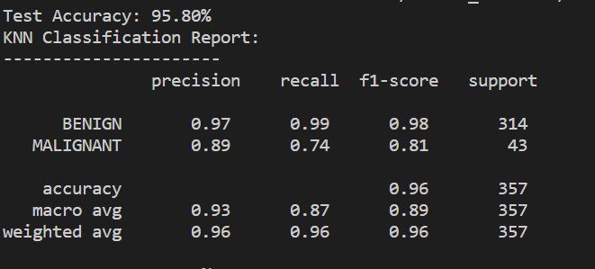

# Malicious and Benign Websites Detection

## Ⅰ. Introduction

In this project, we analyze the detection of malicious and benign websites based on the URL information. We will use four machine learning (KNN, Random Forest, Logistic Regression, Neural Network) methods and compare their results to build an optimal machine learning model.

## Ⅱ. Dataset Used

In this project, we use the dataset which is created by Christian Urcuqui in Malicious and Benign Websites classify by application and network features. Unfortunately, there is a lack of datasets with malicious and benign website, especially for malicious websites. We can look at the following figure, it is the histogram of benign and malicious website. We have a not bad number of benign websites, but for the number of malicious website is really not enough. Finally, we have 1565 samples for benign website and 216 for malicious websites. 
<div align = 'center'>	
</div>

## Ⅲ. Features Used

In this dataset, there are 21 features, the first feature is URL which is just the anonymous identification of the URL, we will reject this feature when we do the machine learning.

- URL: it is the anonymous identification of the URL analyzed in the study

- URL_LENGTH: it is the number of characters in the URL

- NUMBER*SPECIAL*CHARACTERS: it is number of special characters identified in the URL, such as, “/”, “%”, “#”, “&”, “. “, “=”

- CHARSET: it is a categorical value and its meaning is the character encoding standard (also called character set).

- SERVER: it is a categorical value and its meaning is the operative system of the server got from the packet response.

- CONTENT_LENGTH: it represents the content size of the HTTP header.

- WHOIS_COUNTRY: it is a categorical variable, its values are the countries we got from the server response (specifically, our script used the API of Whois).

- WHOIS_STATEPRO: it is a categorical variable, its values are the states we got from the server response (specifically, our script used the API of Whois).

- WHOIS_REGDATE: Whois provides the server registration date, so, this variable has date values with format DD/MM/YYY HH:MM

- WHOIS*UPDATED*DATE: Through the Whois we got the last update date from the server analyzed

- TCP*CONVERSATION*EXCHANGE: This variable is the number of TCP packets exchanged between the server and our honeypot client

- DIST*REMOTE*TCP_PORT: it is the number of the ports detected and different to TCP

- REMOTE_IPS: this variable has the total number of IPs connected to the honeypot

- APP_BYTES: this is the number of bytes transfered

- SOURCE*APP*PACKETS: packets sent from the honeypot to the server

- REMOTE*APP*PACKETS: packets received from the server

- APP_PACKETS: this is the total number of IP packets generated during the communication between the honeypot and the server

- DNS*QUERY*TIMES: this is the number of DNS packets generated during the communication between the honeypot and the server

- TYPE: this is a categorical variable, its values represent the type of web page analyzed, specifically, 1 is for malicious websites and 0 is for benign websites

  

## Ⅳ. Pretreatment of Features

In these dataset, we can't take this data and do machine learning directly, because of these features, not all data are composed of numerical data and binary data. Therefore, we need to transform these features that cannot be applied to machine learning into forms that can be adapted to our model. For the pretreatment, we break it down into five steps:

### 1. Remove unused features

In these 21 features, the first feature "URL" is just a ID which is no practical significance for our machine learning. Hence, I remove this feature at first.

### 2. Transform textual data into binary data by one-hot encoding

The data in 'CHARSET', 'SERVER', 'WHOIS_COUNTRY', 'WHOIS_STATEPRO' are text. In order to fit our machine learning model, I use One Hot Encoding, the value of the discrete feature is extended to the Euclidean space, and a value of the discrete feature corresponds to a point in the Euclidean space. In other word, I use a vector which is composed by 0 and 1. If the value is 1, it means the associated textual feature is present in this sample.

### 3. Extracting information from time

'WHOIS_REGDATE' and 'WHOIS_UPDATED_DATE' are the information of time. They include year, month, day, hour and minute information. I extract these information to compose six new features which are in numerical form.

### 4. Fill in the None Information

I use two ways to manage the None information. For the None in 'content_length' and 'DNS_query_Times', I fill it with the average. For the 'whois_updated_date' and 'whois_regdate', I fill it with 0. Because WHOIS is a database used to find out whether a domain name has been registered, and the details of the registered domain name. If the whois information is None, it means the domain name is not in the whois database. Therefore, 0 is more suitable in this case.

### 5. Normalization

The final step of the pretreatment is normalization. The data in different magnitude greatly affects the results of machine learning, especially in the model for example KNN. It causes different features to have different degrees of influence on the results. Therefore, normalization is the last and integral step.

In conclusion, I have 474 features to complete the following research

## Ⅴ. Model Build

I create four model in our project: KNN, Logistic Regression, Random Forest and Neural Network. For the comparison of the result, I will not use accuracy. Because our dataset is unevenly distributed, the ratio of benign websites to malicious websites is about 8 : 1. Even though our model judges that all websites are benign websites, I will also have the result in high accuracy . Therefore, this metric doesn't has enough signification.

In this case, I choose F1-score as our judgment basis. Because for example the research of malicious websites, precision is the rate that the real malicious websites in the detected malicious websites, recall is the rate that the detected real malicious websites in all the real malicious websites. F1-score is a harmonized average of precision and recall. I use the average of F1-score of benign website and F1-score of malicious website as the final metric of our evaluation of model. This can eliminate the problem of inaccurate judgment of results caused by uneven data distribution.

In addition, it is worth noting that in the study, I often find some parameters most suitable for our dataset through Cross Validation, such as number of K in KNN, etc. In the process of grouping with K-fold,I must use Stratified for that the proportion of malicious websites and Benign websites contained in each fold is the same as that in the total dataset, so as to prevent too many samples of one category in a certain fold from leading to large errors in the final results. 

In the comparison of these model, I use the same seed for the split of training data and validation data.

### 1. KNN

KNN is one of the simplest machine learning models. The idea of this method is very simple and intuitive: if most of the K most similar (the closest in the feature space) samples of a sample belong to a certain category, then the sample also belongs to this category. In the classification decision, the method only determines the category of the samples to be divided according to the category of the nearest one or several samples. 

In this method, the most important parameter is k which is number of nearest neighbor to vote the category of sample. To decide the best K, I use 5-fold cross validation for testing  k = 1, 3, 5. The result is that when k = 3, the model get the best F1-score. 

<div align = 'center'>	

</div>
This figure is a result of complete process of training and then validation. In this result, I can do a conclusion that KNN performs very well in the test of benign websites, with the F1-score reaching 0.98, but the test of malicious websites is relatively not excellent enough. The Recall value is only 0.74, which means that there are many malicious sites that have not been detected. I think this is directly related to the lack of samples of malicious websites.

### 2. Logistic Regression

Logistic Regression is a very common model for the classification problem. In this model, I need to study which degree is the most suitable for our dataset with 5-fold cross validation. I have tested degree = 1, 2, 3, but because the number of features is too large so that the model is difficult to converge for degree = 3 and the training time is very long. In the comparison between degree=1 and degree=2, degree=2 gets a more excellent result.

Then I use 2-degree logistic regression to do the test. This is our result:

<div align = 'center'>	

</div>
According to the above results, I can see that the final result is similar to the result of KNN, and the detection of such malicious websites is still insufficient. But on the other hand, since our ultimate goal is to detect malicious websites. Therefore, logistic regression has a higher recall, that is, more real malicious websites are found. From this point of view, I are more inclined to choose the Logistic regression

### 3. Random Forest

In machine learning, random forest is a classifier containing multiple decision trees, and its output category is determined by the vote of the category output by the individual tree. Compared with logistic regression, the learning process of random forest is faster, and it is not easily affected by over-fitting. In many fields, random forest performs very well. For example, in the detection of phishing email, random forest is one of the best machine learning methods. The results are shown in the figure below:
<div align = 'center'>	

</div>
I can see that this is a very interesting result. The recall of Benign website and the precision of malicious website can even reach 1.00.  I can conclude that as long as it is a malicious website detected by the random forest, it has a very high probability of being a really malicious website. On the contrary, I can't trust a website that has not been detected by random forest.

### 4.  Neural Network

So far, I have not found a model that can really detect enough malicious websites. I try to use neural network. This is a more complex model than the other three approaches. In the hidden layer, I cannot know how it combines and assembles these features. It's hard to understand what it actually means in the hidden layer, but with a lot of data to train, the model tends to give us good results. 

For reducing the training time, I use chi-square to do a rank of features. At first, I want to use the combination of T-student test and cross validation to decide when the result is no longer affected by the new feature. But it is not suitable in our project. Because the influence of each feature on the result is not very great. Even though my critical value is very low, it can still judge that the result is no longer dependent on the new feature when there are few features. But the final F1-score is far below the result of 474 features. Therefore, I chose to use trial and error method to continuously add new features according to the ranking, until I found the one number with the highest of F1-Score.  Finally, I use the first 148 features with the most information gain. 

I use a 3-layers model. The number of nodes per layer will have a significant impact on the final result of the model. Following the above method, I find the group of number of nodes in each layer with the highest F1-score between 10 and 150 with step = 10. Finally, I use 50-70-50 as the hidden layers. 

For finding these parameter, the time used is about 6 hours.

The following figure is the final result of the neural network we built：

<div align = 'center'>	

</div>

From the final result, it can be seen that through neural network, it can find more malicious websites that cannot be found in other models. I think this is the biggest advantage of neural network. As a function similar to firewall, finding problems is far more important than mistake of detection. Therefore, compared with random forest, neural network is better.

## Ⅵ. Combination of Results

Generally, different models have their own unique advantages. Therefore, I want to combine the result of each model to try to make some improvements. This is the final algorithm of the combination:

```python
for i in range(number_of_data):
    if result_random_forest[i] or result_neural_network[i] == 1:
        final_result[i] = 1
    else:
        final_result[i] = 0
```

As we know, neural network can detect more malicious websites compared with other models. Therefore, I want to build the final result on the basis of neural network. In addition, since Random Forest has almost 100% precision, I would like to make a supplement with the result of Random Forest. 

In fact, I also tried to add the results of KNN and Logistic Regression in my combination by many ways, but they often give a negative impact, so I had to give them up.

<div align = 'center'>	

</div>

In this final result, it has the same result with neural network. It is because all the malicious website which is detected by random forest has been detected by neural network. Therefore, the result of random forest is mainly for the purpose of supplement, and it does not necessarily affect the final result.

## Ⅶ. Conclusion

Through our study, we have obtained good results. In the test of Benign website, we can obtain a F1-score = 0.98. However, due to the insufficient data of malicious websites in Dataset, the detection result of our malicious website is not ideal enough. As far as I am concerned, the key point of future work should be to collect more malicious website data and apply it to machine learning in order to obtain a better model.