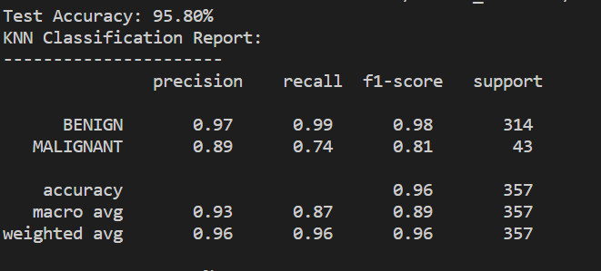

# Malicious and Benign Websites Detection

## Ⅰ. Introduction

In this project, we analyze the detection of malicious and benign websites based on the URL information. We will use four machine learning (KNN, Random Forest, Logistic Regression, Neural Network)methods and compare their results to build an optimal machine learning model.

## Ⅱ. Dataset Used

In this project, we use the dataset which is created by Christian Urcuqui in Malicious and Benign Websites classify by application and network features. Unfortunately, there is a lack of datasets with malicious and benign web characteristics, especially for malicious websites. We can look at the following figure, it is the histogram of benign and malicious website. We have a not bad number of benign websites, but for the number of malicious website is really not enough. Finally, we have 1565 samples for benign website and 216 for malicious websites. 

	

## Ⅲ. Features Used

In this dataset, there are 21 features, the first feature is URL which is just the anonymous identification of the URL, we will reject this feature when we do the machine learning.

- URL: it is the anonymous identification of the URL analyzed in the study

- URL_LENGTH: it is the number of characters in the URL

- NUMBER*SPECIAL*CHARACTERS: it is number of special characters identified in the URL, such as, “/”, “%”, “#”, “&”, “. “, “=”

- CHARSET: it is a categorical value and its meaning is the character encoding standard (also called character set).

- SERVER: it is a categorical value and its meaning is the operative system of the server got from the packet response.

- CONTENT_LENGTH: it represents the content size of the HTTP header.

- WHOIS_COUNTRY: it is a categorical variable, its values are the countries we got from the server response (specifically, our script used the API of Whois).

- WHOIS_STATEPRO: it is a categorical variable, its values are the states we got from the server response (specifically, our script used the API of Whois).

- WHOIS_REGDATE: Whois provides the server registration date, so, this variable has date values with format DD/MM/YYY HH:MM

- WHOIS*UPDATED*DATE: Through the Whois we got the last update date from the server analyzed

- TCP*CONVERSATION*EXCHANGE: This variable is the number of TCP packets exchanged between the server and our honeypot client

- DIST*REMOTE*TCP_PORT: it is the number of the ports detected and different to TCP

- REMOTE_IPS: this variable has the total number of IPs connected to the honeypot

- APP_BYTES: this is the number of bytes transfered

- SOURCE*APP*PACKETS: packets sent from the honeypot to the server

- REMOTE*APP*PACKETS: packets received from the server

- APP_PACKETS: this is the total number of IP packets generated during the communication between the honeypot and the server

- DNS*QUERY*TIMES: this is the number of DNS packets generated during the communication between the honeypot and the server

- TYPE: this is a categorical variable, its values represent the type of web page analyzed, specifically, 1 is for malicious websites and 0 is for benign websites

  

## Ⅳ. Pretreatment of Features

In these dataset, we can't take this data and do machine learning directly, because of these features, not all data are composed of numerical data and binary data. Therefore, we need to transform these features that cannot be applied to machine learning into forms that can be adapted to our model. For the pretreatment, we break it down into five steps:

#### 1. Remove unused features

In these 21 features, the first feature "URL" is just a ID which is no practical significance for our machine learning. Hence, we remove this feature at first.

#### 2. Transform textual data into binary data by one-hot encoding

The data in 'CHARSET', 'SERVER', 'WHOIS_COUNTRY', 'WHOIS_STATEPRO' are text. In order to fit our machine learning model, we use One Hot Encoding, the value of the discrete feature is extended to the Euclidean space, and a value of the discrete feature corresponds to a point in the Euclidean space. In other word, we use a vector which is composed by 0 and 1. If the value is 1, it means the associated textual feature is present in this sample.

#### 3. Extracting information from time

'WHOIS_REGDATE' and 'WHOIS_UPDATED_DATE' are the information of time. They include year, month, day, hour and minute information. We extract these information to compose six new features which are in numerical form.

#### 4. Fill in the None Information

We use two ways to manage the None information. For the None in 'content_length' and 'DNS_query_Times', I fill it with the average. For the 'whois_updated_date' and 'whois_regdate', I fill it with 0. Because WHOIS is a database used to find out whether a domain name has been registered, and the details of the registered domain name. If the whois information is None, it means the domain name is not in the whois database. Therefore, 0 is more suitable in this case.

#### 5. Normalization

The final step of the pretreatment is normalization. The data in different magnitude greatly affects the results of machine learning, especially in the model for example KNN. It causes different features to have different degrees of influence on the results. Therefore, normalization is the last and integral step.

## Ⅴ. Model Build

We create four model in our project: KNN, Logistic Regression, Random Forest and Neural Network. For the comparison of the result, we will not use accuracy. Because our dataset is unevenly distributed, the ratio of benign websites to malicious websites is about 8 : 1. Even though our model judges that all websites are benign websites, we will also have the result in high accuracy . Therefore, this metric doesn't has enough signification.

In this case, we choose F1-score as our judgment basis. Because for example the research of malicious websites, precision is the rate that the real malicious websites in the detected malicious websites, recall is the rate that the detected real malicious websites in all the real malicious websites. F1-score is a harmonized average of precision and recall. We use the average of F1-score of benign website and F1-score of malicious website as the final metric of our evaluation of model. This can eliminate the problem of inaccurate judgment of results caused by uneven data distribution.

#### 1. KNN

KNN is one of the simplest machine learning models. The idea of this method is very simple and intuitive: if most of the K most similar (the closest in the feature space) samples of a sample belong to a certain category, then the sample also belongs to this category. In the classification decision, the method only determines the category of the samples to be divided according to the category of the nearest one or several samples. 

In this method, the most important parameter is k which is number of nearest neighbor to vote the category of sample. To decide the best K, I use 5-fold cross validation for testing  k = 1, 3, 5. The result is that when k = 3, the model get the best F1-score. 

	

This figure is a result of complete process of training and then validation. In this result, we can do a conclusion that KNN performs very well in the test of benign websites, with the F1-score reaching 0.97, but the test of malicious websites is relatively not excellent enough. The Recall value is only 0.65, which means that there are many malicious sites that have not been detected. We think this is directly related to the lack of samples of malicious websites.

#### 2. Logistic Regression

Logistic Regression is a very common model for the classification problem. 